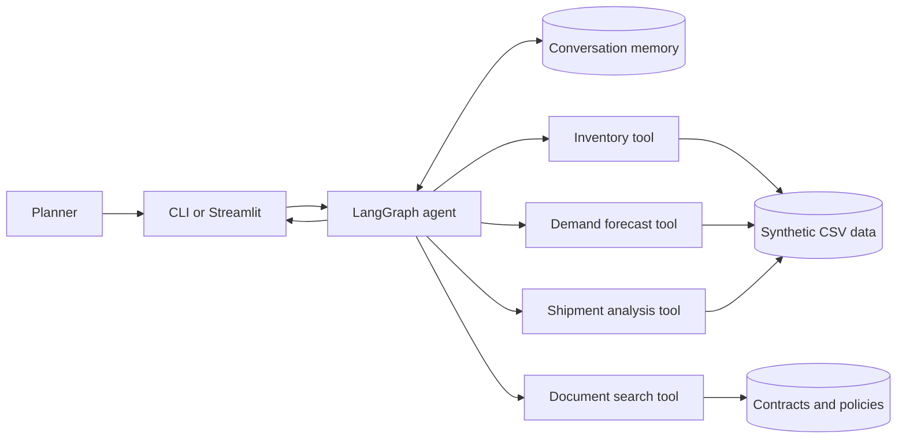

# Supply Chain Copilot

[](https://github.com/farisjamal/supply-chain-copilot/actions/workflows/tests.yml)


Supply Chain Copilot is a portfolio project that demonstrates how an AI agent can support supply-chain operations planning. A planner asks a question in plain English, and the agent calls Python tools to check inventory, forecast demand, analyse shipments, or search supplier documents before recommending an action.

The included company data, supplier contracts, and policies are synthetic. The project can run fully locally with Ollama and does not require an API key.

## What the project demonstrates

- A LangGraph agent with tool calling, planning, and per-thread conversation memory
- Five operational tools for inventory, demand, shipments, low-stock reporting, and document search
- A local RAG pipeline over supplier contracts, logistics procedures, and inventory policies
- Random Forest demand forecasting with a time-based holdout and MAE reporting
- Isolation Forest detection of unusual shipment delays
- A Streamlit and Plotly dashboard for KPIs, charts, forecasts, and agent chat
- Automated tests that do not require an LLM or API key

## Example use case

A planner asks:

> Do we need to worry about keyboard stock?

The agent can:

1. Check how many keyboards are currently in stock.
2. Estimate how many days that stock will last.
3. Forecast demand during the supplier's lead time.
4. Check supplier performance or contract terms if needed.
5. Return a recommendation based on the tool results.

## Architecture



For a more detailed explanation, read [Architecture](docs/ARCHITECTURE.md).

## Project structure

```text
supply-chain-copilot/
|-- .github/workflows/tests.yml       # GitHub Actions test workflow
|-- data/docs/                        # Synthetic contracts, policies, and SOPs
|-- docs/
|   |-- ARCHITECTURE.md               # Technical design and data flow
|   `-- DEMO_GUIDE.md                 # Interview demonstration script
|-- supplychain_copilot/
|   |-- agent/
|   |   |-- graph.py                  # Agent assembly and conversation memory
|   |   |-- prompts.py                # Agent instructions and grounding rules
|   |   `-- tools.py                  # Five tools available to the agent
|   |-- dashboard/app.py              # Streamlit user interface
|   |-- ml/                           # Forecasting and anomaly detection
|   |-- rag/pipeline.py               # Local document retrieval pipeline
|   |-- config.py                     # LLM provider configuration
|   |-- data_gen.py                   # Reproducible synthetic data generator
|   |-- data_store.py                 # Cached data-loading functions
|   `-- cli.py                        # Terminal chat interface
|-- tests/                            # Unit and graph-compilation tests
|-- .env.example                      # Safe configuration template
|-- requirements.txt                  # Python dependencies
|-- START_CHAT.bat                    # Windows terminal-chat launcher
`-- START_DASHBOARD.bat               # Windows dashboard launcher
```

## Getting started

### Requirements

- Python 3.11 or newer
- [Ollama](https://ollama.com/) with the `llama3.2` model, or an Anthropic/OpenAI API key

### First-time setup on Windows

```powershell
git clone https://github.com/farisjamal/supply-chain-copilot.git
cd supply-chain-copilot

py -3.11 -m venv .venv
.venv\Scripts\python.exe -m pip install -r requirements.txt
Copy-Item .env.example .env

ollama pull llama3.2
.venv\Scripts\python.exe -m supplychain_copilot.data_gen
```

Keep Ollama running when using the agent. The default `.env.example` is already configured for the local `llama3.2` model.

### Launch the dashboard

Double-click `START_DASHBOARD.bat`, or run:

```powershell
.venv\Scripts\python.exe -m streamlit run supplychain_copilot/dashboard/app.py
```

### Use terminal chat

Double-click `START_CHAT.bat`, or run:

```powershell
.venv\Scripts\python.exe -m supplychain_copilot.cli
```

You can also send a single question:

```powershell
.venv\Scripts\python.exe -m supplychain_copilot.cli "Which SKUs need reordering?"
```

## Suggested demo questions

- `Which SKUs need reordering right now?`
- `Do we need to worry about monitor stock? Include the demand forecast.`
- `How reliable is Shenzhen Electro?`
- `What are the payment terms in the Acme contract?`
- Follow with `What products does that contract cover?` to demonstrate memory.

See [Demo Guide](docs/DEMO_GUIDE.md) for a short interview walkthrough.

## Tests

The test suite checks forecasting, retrieval, tools, and agent-graph compilation without calling an external language model.

```powershell
.venv\Scripts\python.exe -m pytest -q
```

GitHub Actions runs the same tests on every push and pull request.

## How the role requirements map to the code

| Capability | Implementation |
|---|---|
| Agentic AI | LangGraph agent loop in [`agent/graph.py`](supplychain_copilot/agent/graph.py) |
| Tool calling | Five typed tools in [`agent/tools.py`](supplychain_copilot/agent/tools.py) |
| Memory | LangGraph checkpointer, separated by conversation `thread_id` |
| Prompt engineering | Role, tool policy, grounding rules, and example in [`agent/prompts.py`](supplychain_copilot/agent/prompts.py) |
| RAG | Chunking, TF-IDF retrieval, and source return in [`rag/pipeline.py`](supplychain_copilot/rag/pipeline.py) |
| Machine learning | Random Forest forecasting and Isolation Forest anomaly detection in [`ml/`](supplychain_copilot/ml) |
| Data visualisation | Streamlit and Plotly dashboard in [`dashboard/app.py`](supplychain_copilot/dashboard/app.py) |
| Supply-chain concepts | Reorder points, days of cover, lead times, on-time delivery, MOQs, and incoterms |

## Design choices

- **LangGraph:** the use case needs one assistant that can repeatedly choose and call tools. The graph can later grow into specialist agents.
- **TF-IDF retrieval:** the knowledge base is small and contains exact domain terms, so local lexical retrieval is fast, explainable, and sufficient for this demonstration.
- **Random Forest forecasting:** lag and calendar features capture nonlinear demand patterns without requiring a large time-series stack.
- **Python-calculated facts:** the model chooses tools and explains results, while Python performs numerical calculations to reduce invented figures.
- **Local-first setup:** Ollama keeps the demonstration free and avoids sending synthetic operational data to a cloud model.

## Current limitations

- All business data and documents are synthetic.
- Conversation memory resets when the application restarts.
- TF-IDF is suitable for this small document set; a larger deployment would use embeddings and a vector database.
- The forecasting model is educational and would require deeper validation before supporting real purchasing decisions.

## Security and privacy

Local secrets and generated files are excluded from version control. Never commit `.env`, API keys, private-key files, or `.streamlit/secrets.toml`. Use `.env.example` only as a safe template.

## Future improvements

- Add persistent SQLite conversation memory
- Add embeddings and a vector database for larger document collections
- Add agent evaluation against a set of expected answers
- Add procurement and logistics specialist agents under a supervisor graph
- Connect to an approved ERP or warehouse API instead of synthetic CSV data
