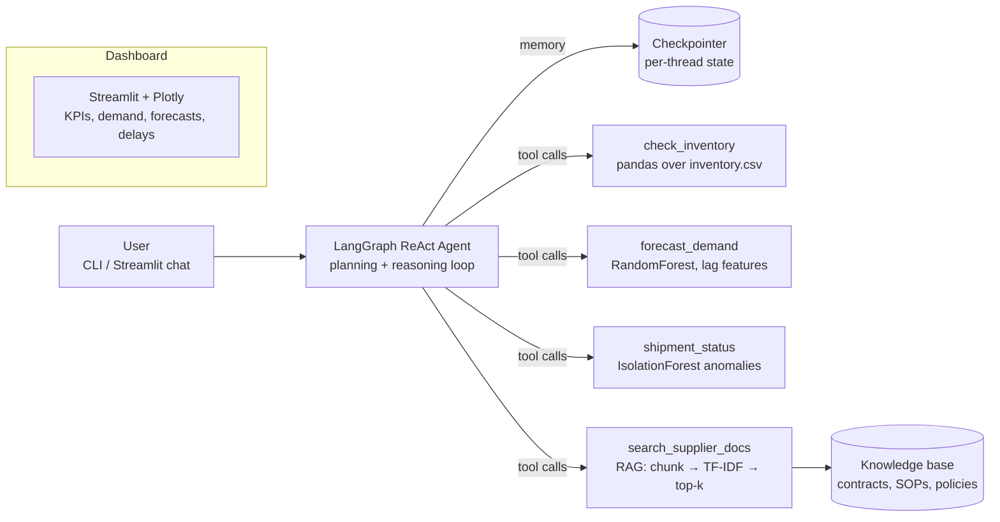

# 📦 Supply Chain Copilot

An **agentic AI assistant for supply chain operations**: a LangGraph ReAct agent that answers planner questions by calling Python tools — live inventory checks, ML demand forecasts, shipment-anomaly detection, and RAG retrieval over supplier contracts — with a Plotly/Streamlit dashboard on top.

> Ask it things like *"Which SKUs risk stockout, and what do our contracts say about expediting?"* and it plans, chains tools, and answers with cited sources and quantified uncertainty.

## Architecture



## How this maps to an Agentic AI role

| Skill | Where it lives in this repo |
|---|---|
| **Agentic AI frameworks (LangGraph/LangChain)** | [`agent/graph.py`](supplychain_copilot/agent/graph.py) — ReAct agent graph, model↔tool loop, checkpointer |
| **Tool calling** | [`agent/tools.py`](supplychain_copilot/agent/tools.py) — 5 typed tools with LLM-facing docstrings |
| **Memory** | LangGraph checkpointer per `thread_id` — multi-turn follow-ups keep context ([`agent/graph.py`](supplychain_copilot/agent/graph.py)) |
| **Planning & reasoning** | ReAct loop + explicit planning policy in the system prompt |
| **Prompt engineering** | [`agent/prompts.py`](supplychain_copilot/agent/prompts.py) — role, tool policy, grounding rules, output contract, few-shot example |
| **LLM familiarity** | Provider-agnostic: Anthropic / OpenAI / local Ollama ([`config.py`](supplychain_copilot/config.py)) |
| **RAG pipeline** | [`rag/pipeline.py`](supplychain_copilot/rag/pipeline.py) — ingest → chunk → vectorize → retrieve → grounded, cited answers |
| **ML concepts** | [`ml/forecasting.py`](supplychain_copilot/ml/forecasting.py) — feature engineering, train/holdout split, MAE; [`ml/anomaly.py`](supplychain_copilot/ml/anomaly.py) — IsolationForest |
| **Data visualization** | [`dashboard/app.py`](supplychain_copilot/dashboard/app.py) — Plotly charts, KPIs, forecast overlay |
| **Supply chain / operations** | Reorder points, days of cover, lead times, OTD rates, incoterms, MOQs — in the data model, tools, and knowledge base |
| **Python** | Everything; tested with `pytest` (`tests/`) |

## Quickstart

```bash
git clone <this repo> && cd supply-chain-copilot
python -m venv .venv && .venv\Scripts\activate     # Windows
pip install -r requirements.txt

# generate the synthetic dataset (2 years of orders, inventory, shipments)
python -m supplychain_copilot.data_gen

# configure an LLM (copy .env.example -> .env, set ONE provider)
#   no API key? use Ollama: install from ollama.com, `ollama pull llama3.2`, LLM_PROVIDER=ollama

# run tests (no LLM needed — tools, ML, RAG are pure Python)
pytest

# chat in the terminal
python -m supplychain_copilot.cli "which SKUs need reordering?"

# or launch the dashboard
streamlit run supplychain_copilot/dashboard/app.py
```

## Example agent session

```
you> Do we need to worry about keyboard stock?

copilot> Yes — SKU-1003 is below its reorder point with ~9 days of cover,
while Shenzhen Electro's lead time is 18 days (on-time rate ~82%).
Forecast demand over the lead time is ~700 units (holdout MAE 4.1/day).
Recommend raising a PO today; note the contract has no late penalty for
the first 5 days, so build in buffer (source: supplier_contract_shenzhen.md).
```

## Design decisions (interview talking points)

- **Why LangGraph over CrewAI/AutoGen:** the task is one assistant with tools, not a multi-agent crew; LangGraph's ReAct prebuilt gives an inspectable state machine with checkpointing for free, and the graph can grow into multi-agent later.
- **Why TF-IDF for retrieval:** the knowledge base is small and domain-specific; TF-IDF is local, fast, dependency-light, and easy to reason about. The `Retriever` class is the seam — swapping in sentence-transformer embeddings + Chroma changes one module, not the agent.
- **Why RandomForest for forecasting:** lag + calendar features capture trend and weekly seasonality without a heavy time-series stack; a time-based holdout (last 56 days) gives an honest MAE the agent quotes as uncertainty.
- **Why tools return text, not JSON blobs:** compact structured text keeps token cost low and is what the model reasons over best; the numbers are computed in pandas, never by the LLM.
- **Failure handling:** unknown SKUs return corrective messages (the agent self-corrects), missing API keys degrade gracefully in the dashboard, and the system prompt forbids invented facts.

## Extending

- Swap TF-IDF → embeddings + vector DB (Chroma) for semantic retrieval
- Add a supervisor + specialist agents (procurement, logistics) — LangGraph multi-agent
- Persist memory to SQLite (`langgraph-checkpoint-sqlite`) for cross-session threads
- Add tool-level evals (e.g. agent answers vs golden answers on a question set)
