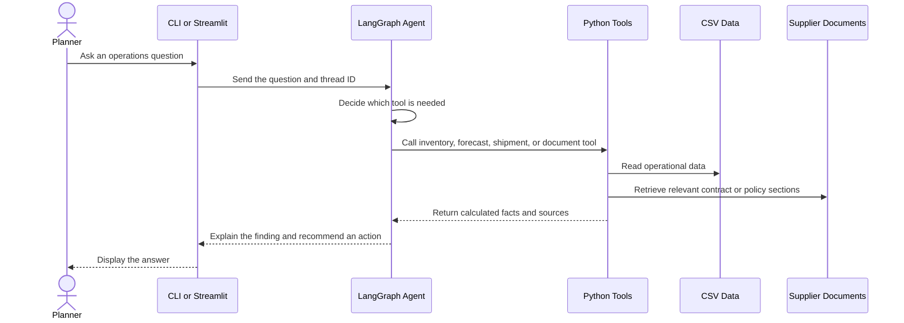

# Architecture

Supply Chain Copilot is a local-first AI assistant for supply-chain planners. It combines a language model with Python tools so that operational facts come from data and documents instead of being invented by the model.

## Request flow

## Main components

| Component | Responsibility |
|---|---|
| `agent/graph.py` | Builds the LangGraph agent and stores conversation state per thread. |
| `agent/prompts.py` | Defines the agent's role, tool-use rules, grounding rules, and answer format. |
| `agent/tools.py` | Exposes five safe Python functions that the model can call. |
| `rag/pipeline.py` | Splits local documents, builds a TF-IDF index, and returns relevant passages. |
| `ml/forecasting.py` | Builds demand features and trains a Random Forest forecast model. |
| `ml/anomaly.py` | Uses Isolation Forest to flag unusual shipment delays. |
| `data_store.py` | Loads and caches CSV data for reuse by tools and the dashboard. |
| `data_gen.py` | Creates reproducible synthetic orders, inventory, suppliers, and shipments. |
| `dashboard/app.py` | Presents KPIs, charts, forecasts, and agent chat in Streamlit. |

## Agent loop

The LangGraph agent follows a simple loop:

1. Read the planner's question and conversation history.
2. Choose one or more tools based on the question.
3. Execute each tool and inspect the returned facts.
4. Continue calling tools if more evidence is needed.
5. Write a concise recommendation grounded in the tool results.

The language model chooses the action, while Python performs calculations and document retrieval. This separation reduces invented numbers and makes the result easier to trace.

## Retrieval pipeline

The document-search tool uses a small local RAG pipeline:

1. Load Markdown contracts, policies, and SOPs from `data/docs/`.
2. Split each file by headings into smaller sections.
3. Convert sections into TF-IDF vectors.
4. Compare the user's query with each section using cosine similarity.
5. Return the strongest matches with filenames as citations.

TF-IDF was selected because the demonstration knowledge base is small, local, and rich in exact business terms such as supplier names, incoterms, and payment clauses.

## Machine-learning pipeline

Demand forecasting uses calendar and lag features such as day of week, recent demand, and rolling averages. A Random Forest model is trained per SKU, with the most recent period held out for evaluation. The tool reports both the forecast and mean absolute error so the planner can see the uncertainty.

Shipment anomaly detection uses Isolation Forest over delivery-delay and transit-time features. It highlights shipments whose behaviour differs strongly from normal deliveries.

## Data and security boundaries

- The included business data is synthetic and contains no real company information.
- `.env`, virtual environments, generated CSV files, private keys, and Streamlit secrets are excluded by `.gitignore`.
- The default Ollama setup runs the language model locally and does not require an API key.
- Cloud API keys, if used, belong only in the local `.env` file.
